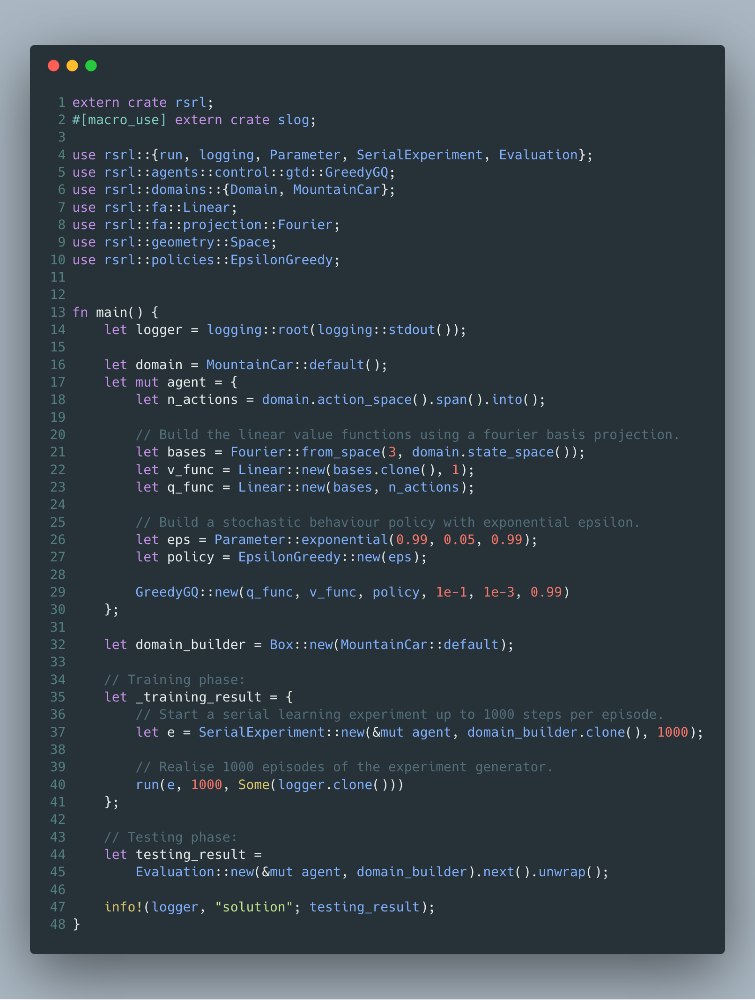

# RSRL ([api](https://tspooner.github.io/rsrl))

[](https://crates.io/crates/rsrl)
[](https://travis-ci.org/tspooner/rsrl)
[](https://coveralls.io/github/tspooner/rsrl?branch=master)

> Reinforcement learning should be _fast_, _safe_ and _easy to use_.

## Overview

``rsrl`` provides generic constructs for running reinforcement learning (RL)
experiments by providing a simple, extensible framework and efficient
implementations of existing methods for rapid prototyping.

## Installation
```toml
[dependencies]
rsrl = "0.3"
```

## Usage
The code below shows how one could use `rsrl` to evaluate a
[GreedyGQ](http://old.sztaki.hu/~szcsaba/papers/ICML10_controlGQ.pdf) agent
using a Fourier basis function approximator to solve the canonical mountain car
problem.

> See [examples/](https://github.com/tspooner/rsrl/tree/master/examples) for
> more...



## Contributing
Pull requests are welcome. For major changes, please open an issue first to
discuss what you would like to change.

Please make sure to update tests as appropriate and adhere to the angularjs commit message conventions (see [here](https://gist.github.com/stephenparish/9941e89d80e2bc58a153)).

## License
[MIT](https://choosealicense.com/licenses/mit/)
